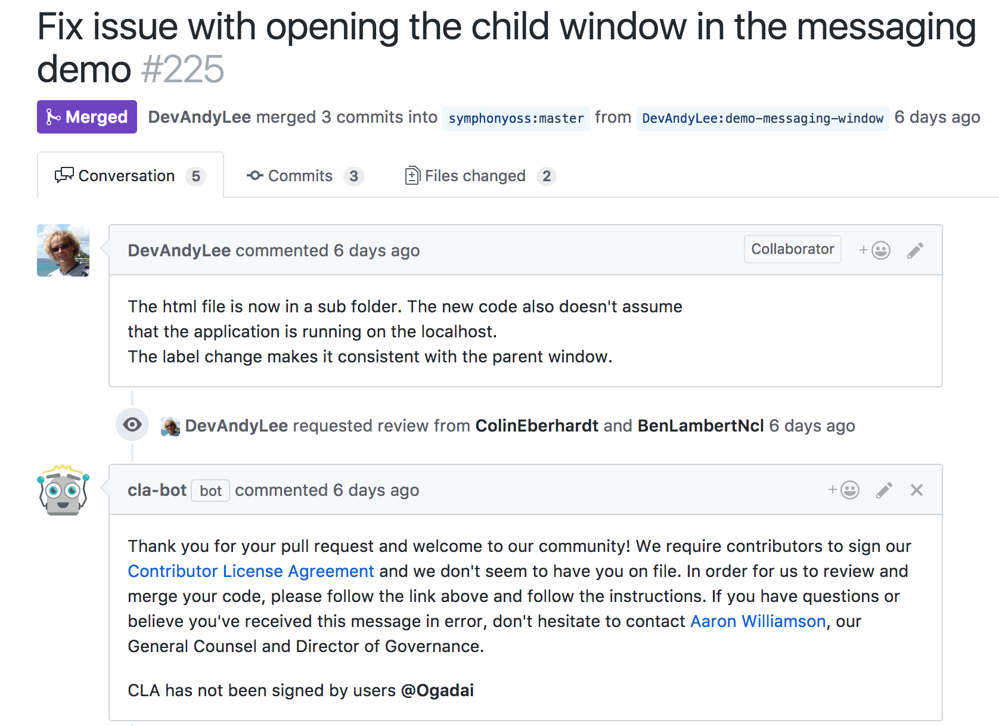
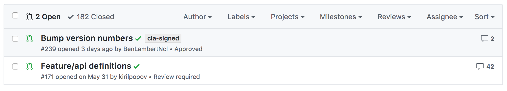
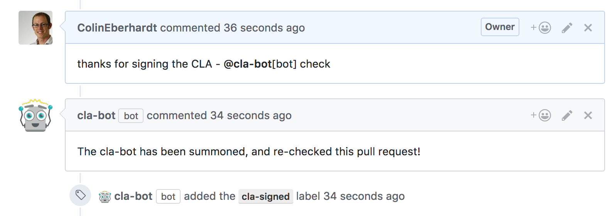

# cla-bot

cla-bot is a GitHub Application for automation of Contributor Licence Agreements (CLAs). It checks whether contributors have signed an agreement, adding labels to PRs if they have, or prompting for signature if they have not.

This bot has the following features:
 - Easy integration on projects or whole organisation as a GitHub App
 - Automatically checks every pull request and every commit
 - Pull requests are re-check on each push
 - The approved contributor list can be maintained in various ways including JSON files or a webhook
 - A re-check for a pull request can be triggered
 - Uses labels and status checks to make the process visible
 - Provides a fully-hosted solution, you don't have to maintain your own bit installation
 - You can provide templates for the various messages this bot posts

## What is a CLA?

If you maintain an open source project you'll likely have selected an open source licence that governs your project. This provides an implicit agreement for contributors to your project, whereas a Contributor Licence Agreement (CLA) makes these terms explicit and provides a record of these agreements.

As described via [Wikipedia](https://en.wikipedia.org/wiki/Contributor_License_Agreement)

> The purpose of a CLA is to ensure that the guardian of a project's outputs has the necessary ownership or grants of rights over all contributions to allow them to distribute under the chosen license.

You can find example CLAs from [GitHub](https://cla.github.com/), [Facebook](https://code.facebook.com/cla), [Microsoft](https://cla.microsoft.com/), [JSFoundation](https://js.foundation/CLA) and many other projects.

## What does cla-bot do?

Adding a CLA to your project workflow can add quite a bit of overhead. For each pull request you need to ensure that each committer has signed your CLA before merging. For small projects this can probably be done manually, but for larger projects you probably want to automate this process.

As you can see from the above examples CLAs differ between projects, and the mechanics for signing them also differ. For that reason this bot doesn't automate that part of the process. However, the process of checking pull requests against a list of (approved) contributors is what this bot automates.

For projects that use the cla-bot, when a pull request is opened, the commits are checked to determine the CLA status for each committer. If any fail the check, the bot posts a (customisable) comment, prompting them to get in touch and arrange a CLA:



If the checks pass, a (configurable) label is added to the pull request:



In each case the pull request status is set to a pass or fail. It's a good idea to make the `verification/cla-signed` status a required status check so that it must pass before pull requests are merged.

If a committer signs the CLA and you wish to have a pull request re-check, you can request this posting a comment that contains the text `@cla-bot check`:



## Installing cla-bot

The cla-bot is a GitHub App making it very easy to install for individual projects, or entire organizations. You don't have to host anything yourself in order to run the bot, you simply provide configuration. To install the bot, visit https://github.com/apps/cla-bot, click 'Install', and select the project(s) that you want to enable cla-bot on. Once enabled, cla-bot will be informed whenever a pull request is opened or updated on any of the selected repositories.

When a pull request opened, cla-bot checks all the committers to ensure that they have a signed CLA. In order for cla-bot to perform this check you need to add a `.clabot` file to your repository. There are various configuration options available for specifying how contributors are verified, with the most simple being a list of GitHub accounts for contributors with a CLA.

You might want to try out the bot in a test repo. Here's an example `.clabot` file:

~~~json
{
  "contributors": ["YourUsername"]
}
~~~

Once added, try creating a pull request to see the bot in action.

All of the configuration relating to this bot is performed via the `.clabot` file.

## Configuration options

### .clabot resolution

The `.clabot` is automatically resolved in the root project folder (for example this project resolves the following file, `https://github.com/ColinEberhardt/cla-bot/.clabot`). If you have multiple repositories within the same organization, or user account, that have the same contributors, you can create a single configuration by adding a project called `clabot-config`. For example, for my personal projects I could configure the bot via `https://github.com/ColinEberhardt/cla-config/.clabot`.

Note, if you do not want the list of contributors to be public, the `cla-config` project can be private.

### configuration schema

The `.clabot` file has four properties:

~~~json
{
  "contributors": "...",
  "message": "...",
  "label": "...",
  "recheckComment": "..."
}
~~~

 - `contributors` - details the contributors with signed CLAs, more on this later.
 - `message` (optional) - the message that the bot adds as a comment if an of the committers for a pull request have not signed a CLA.
 - `label` (optional) - the label applied to a pull request if all committers have a signed CLA.
 - `recheckComment` (optional) - the comment added when the bot is manually requested to re-check a pull request.

### contributors option

There are various ways in which you can specify the list of contibutors:

1. You can embed the contributors directly into the `.clabot` file as an array of GitHub usernames:

~~~json
{
  "contributors": [ "frank", "bob", "sam" ]
}
~~~

2. You can specify a URL which returns the contributors list (as a JSON array)

~~~json
{
  "contributors: "http://foo.com/static/contributors"
}
~~~

3. If the contributors URL uses the GitHub API, the bot will be authenticated, allowing it to access private repositories

~~~json
{
  "contributors": "https://api.github.com/repos/foo/bar/contents/.contributors",
}
~~~

4. You can supply a webhook which has a querysting that is invoked for each committer:

~~~json
{
  "contributors: "http://foo.com/contributor?checkContributor="
}
~~~

With each invocation, the `checkContributor` querystring parameter is used to supply the committer username. The webhook should return a JSON response that indicates whether the committer has signed a CLA:

~~~json
{
  isContributor: true
}
~~~

### Adding a custom message

If you wish to add a custom message, include a `message` property within the `.cla-bot` file. This can optionally include a `{{usersWithoutCLA}}` token which is expanded out to the names of the contributors who have not signed a CLA.

For example:

~~~json
{
  "message": "We require contributors to sign our Contributor License Agreement, and we don\"t have {{usersWithoutCLA}} on file. In order for us to review and merge your code, please contact @FriendlyAdmin to get yourself added."
}
~~~

It is good practice to include details of who to contact in order to go ahead with the CLA signing process.

### Adding a custom label

If a PR is opened where all the contributors have signed the CLA, it is labelled with `cla-signed`. You can configure this behaviour as follows:

~~~json
{
  "label": "my-custom-label"
}
~~~

## Development

You know ... the usual ...

~~~console
npm install
~~~

### Running locally

For most end users cla-bot will be added to a project as an integration, this provides the simplest integration experience. However, this is also the most complex from a set-up perspective! In order to simplify things, in development, you can run the bot as a simple webhook integration.

1. Create a [personal access token](https://github.com/settings/tokens) for the account that you want to run the bot as.
2. Edit `deploy.env.example`, renaming to `deploy.env`, and add the personal access token generated above to `GITHUB_ACCESS_TOKEN`.
3. Ensure `INTEGRATION_ENABLED` is set to false.
4. Find a suitable repo to test against, and add a `.clabot` file.
5. The `event.json` provides an example webhook (with most of the fields removed) that the bot receives when a PR is opened. Edit this file so that it points to a PR in your test repository.
6. The bot comments, adds labels, and updates the status of commits. In order to do this it needs write access to the repo. Note that the integration only requests the minimal permissions required to perform these functions. Either the repo you are using to test against in (4) needs to be owned by the user from (1), or you need to add the user as a collaborator or team member.
7. You're ready to go!!!

Run the bot as follows:

```
$ npm run execute  
```
